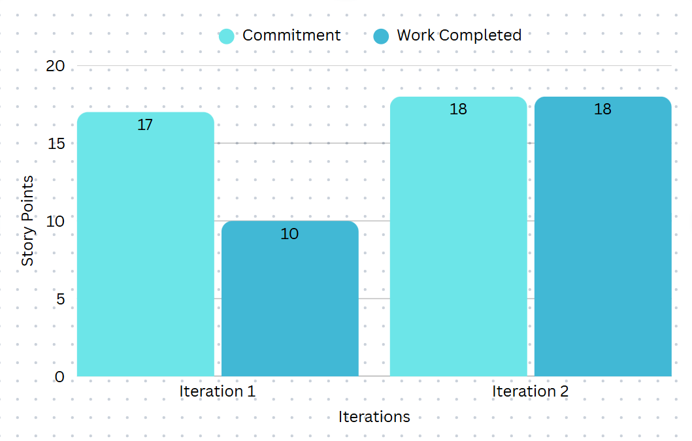

# COMP 3350 Retrospective

After having discussed with the group, we had come to the conclusion that despite having reached all of our goals, there were still some issues that brought down the success of the project. The first issue that we had was the creation of objects within the persistence layer that needed to be placed in the business layer. This is one of the easier pieces that can be improved by moving the creation of the objects to a more appropriate place. Secondly, we have code in the presentation layer that needs to be in the business layer. This can easily be fixed by pushing the code down to the business layer and calling it in the presentation layer with a method call. Next, one of the issues that arose a lot after talking to the professor and feedback from markers was that the documentation for our code was very inconsistent. Hence, we will take some time to add more comments, especially in the presentation layer. The next issue is cleaning up dead code, primarily the unused constructors in domain-specific object classes. This is another easily fixed issue that can be solved by removing any dead code that we had. The following issue is a result of repetition issues, especially with the buttons in the multiple-choice activity (MCQuestionActivity). We can fix this by modularizing the code so that the buttons are handled separately. Lastly and arguably one of the greatest issues is the distribution of the tasks between team members. Initially, we severely underestimated the time it would take to complete individual layers such as the database layer. This can be resolved and improved by improving communication between team members, and separating the uneven task distribution so that the other layers can take on an equal workload.

To enhance the project, we identified key areas of improvement, focusing on user interaction and code quality. Our goal was to ensure the application provided an interactive experience similar to a video game while maintaining clean and maintainable code. Initially, In terms of the user interaction we wanted the application to feel like an experience similar to that of a video game. To do this we will implement a leaderboard for the top score, add a feature to delete the quiz, and provide a search bar for users to look up quizzes. Firstly, Create a quiz preview page and an end page to display scores, while restructuring the leaderboard code to follow design principles, particularly DRY. This can be measured by the success of the feature, and the modularity of its design. Secondly, we can refactor methods from setters to getters where appropriate so that we can enforce data encapsulation and prevent unintended access to quizzes. We can measure this through the number of operations that change data. Next, we can ensure the search feature is efficiently integrated, by optimizing the operation of the database for performance. This can be measured by the quality of the results based on the user’s input. Lastly, we can refactor object classes to improve maintainability and readability, ensuring a modular design. This can be measured by a decrease in the code’s complexity and a reduction in the duplication of any code which will increase its maintainability.

 

    

