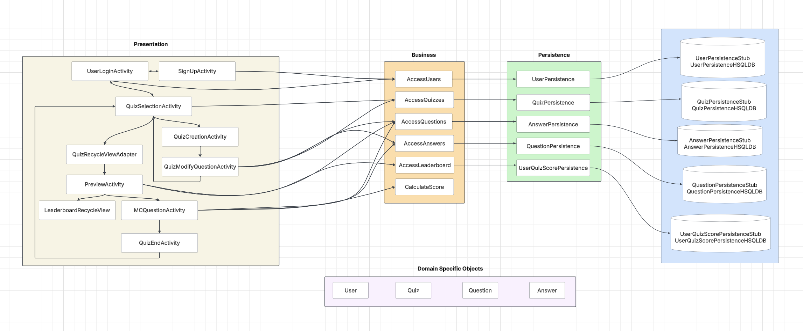
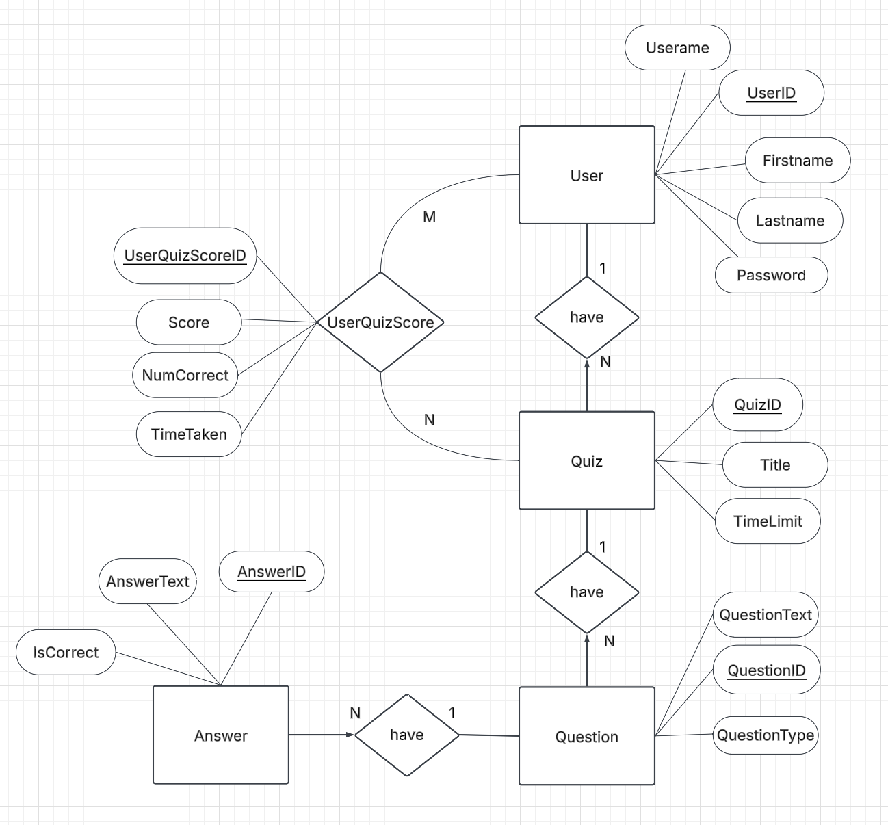

# Quiz"R"Us Architecture

## Table of Contents
- [Quiz"R"Us Architecture](#quizrus-architecture)
  - [Table of Contents](#table-of-contents)
  - [Application](#application)
  - [Domain Specific Objects](#domain-specific-objects)
    - [User](#user)
    - [Quiz](#quiz)
    - [Question](#question)
    - [Answer](#answer)
    - [UserQuizScore](#userquizscore)
  - [Presentation Layer](#presentation-layer)
    - [QuizRecycleViewAdapter](#quizrecycleviewadapter)
    - [MCQuestionActivity](#mcquestionactivity)
    - [QuizCreationActivity](#quizcreationactivity)
    - [QuizModifyQuestionActivity](#quizmodifyquestionactivity)
    - [QuizSelectionActivity](#quizselectionactivity)
    - [SignUpActivity](#signupactivity)
    - [UserLoginActivity](#userloginactivity)
    - [LeaderboardRecycleViewAdapter](#leaderboardrecycleviewadapter)
    - [PreviewActivity](#previewactivity)
    - [QuizEndActivity](#quizendactivity)
  - [Business Layer](#business-layer)
    - [AccessUsers](#accessusers)
    - [AccessQuizzes](#accessquizzes)
    - [AccessQuestions](#accessquestions)
    - [AccessAnswers](#accessanswers)
    - [CalculateScore](#calculatescore)
  - [Persistence Layer](#persistence-layer)
    - [UserPersistence](#userpersistence)
      - [UserPersistenceStub](#userpersistencestub)
      - [UserPersistenceHSQLDB](#userpersistencehsqldb)
    - [QuizPersistence](#quizpersistence)
      - [QuizPersistenceStub](#quizpersistencestub)
      - [QuizPersistenceHSQLDB](#quizpersistencehsqldb)
    - [QuestionPersistence](#questionpersistence)
      - [QuestionPersistenceStub](#questionpersistencestub)
      - [QuestionPersistenceHSQLDB](#questionpersistencehsqldb)
    - [AnswerPersistence](#answerpersistence)
      - [AnswerPersistenceStub](#answerpersistencestub)
      - [AnswerPersistenceHSQLDB](#answerpersistencehsqldb)
    - [UserQuizScorePersistence](#userquizscorepersistence)
      - [UserQuizScorePersistenceStub](#userquizscorepersistencestub)
      - [UserQuizScorePersistenceHSQLDB](#userquizscorepersistencehsqldb)
  - [Architecture Diagram](#architecture-diagram)
  - [ER Diagram](#er-diagram)

## Application
The application directory holds the classes that provide access to the persistence classes. In iteration 1, `Services.java` provides clean access to `UserPersistence`, `QuizPersistence`, `QuestionPersistence`, and `AnswerPersistence` classes.

**Package**: `comp3350.quizrus.application;`

## Domain Specific Objects
This section defines the core objects of the Quiz"R"Us system. They are an integral part of all 3 layers.

**Package**: `comp3350.quizrus.application;`

### User
The `User` represents an individual interacting with the system e.g., working with a quiz. A quiz must be associated with a user.

### Quiz
The `Quiz` object represents a collection of questions grouped together for a specific purpose.

### Question
Each `Question` belongs to a quiz and consists of a prompt and multiple possible answers.

### Answer
An `Answer` represents a response to a question. It can be correct or incorrect, depending on the question type (multiple choice, true/false, etc.).

### UserQuizScore
The `UserQuizScore` object represents the performance of a User on a specific Quiz. It stores essential details such as the number of correct answers, the time taken to complete the quiz, and the final calculated score.

## Presentation Layer
This section is responsible for all of the UI.

**Package**: `comp3350.quizrus.presentation;` 

### QuizRecycleViewAdapter
A recycle view adapter is responsible for setting up the quiz items in the QuizSelectionActivity UI page

### MCQuestionActivity
A multiple choice questions UI page that opens up when the user select a quiz in the quiz selection page UI, responsible for showing the questions and it's available answer after user submitting the answer. r

### QuizCreationActivity
This is a customizable quiz page that opens when the user presses the + button in the top right corner of the screen. This is responsible for creating the quiz name and the length of time the quiz will be.

### QuizModifyQuestionActivity
This page focuses on editing the questions that will be contained within each quiz. This open after the user selects "Edit Questions" on the bottom of the Quiz creation page. This is responsible for setting each set of the questions and the answers associated with them.

### QuizSelectionActivity
The Main page of the app, where it shows a list of quizzes, and user can select which quiz they want to play

### SignUpActivity
It is a sign up page where the user can create a new account.

### UserLoginActivity
This is the first page that opens up when the app runs, it prompts user login info.

### LeaderboardRecycleViewAdapter
The `LeaderboardRecycleViewAdapter` is a custom adapter for displaying quiz leaderboards using RecyclerView. It organizes and presents quiz scores, ranks users based on performance, and visually highlights top rankings.

### PreviewActivity
The `PreviewActivity` displays an overview of a selected quiz, including metadata, user performance, and a leaderboard.

### QuizEndActivity
The `QuizEndActivity` class  handles the quiz completion screen. It displays the user's score, time remaining, and leaderboard rankings.

## Business Layer
This section is responsible for communication between the UI and database layers.

**Package**: `comp3350.quizrus.business;`

### AccessUsers
This is used by the user interface to get a list of all the users in the database.

### AccessQuizzes
This is used by the user interface to get a list of all the quizzes in the database.

### AccessQuestions
This is used by the user interface to get a list of all the questions for a quiz in the database.

### AccessAnswers
This is used by the user interface to get a list of all the answers for a question in the database. There is also a method for finding the position of the correct answer.

### CalculateScore
The `CalculateScore` class provides a static method to compute a user's final quiz score based on the number of correct answers, total quiz time, and time taken.

## Persistence Layer
The `Persistence Layer` is responsible for storing and retrieving data. This layer ensures data integrity and optimal performance through efficient database or stub interactions.

**Package**: `comp3350.quizrus.persistence;`  

### UserPersistence
Handles user-related data operations, such as registration, login, and profile management.

#### UserPersistenceStub
A mock implementation for testing `User` operations.

#### UserPersistenceHSQLDB
A class that implements `UserPersistence` and handles SQL-based database operations for the `User` entity using HSQLDB.

### QuizPersistence
Manages quiz-related storage.

#### QuizPersistenceStub
A mock implementation for testing `Quiz` operations.

#### QuizPersistenceHSQLDB
A class that implements `QuizPersistence` and handles SQL-based database operations for the `Quiz` entity using HSQLDB.

### QuestionPersistence
Manages question-related storage.

#### QuestionPersistenceStub
A mock implementation for testing `Question` operations.

#### QuestionPersistenceHSQLDB
A class that implements `QuestionPersistence` and handles SQL-based database operations for the `Question` entity using HSQLDB.

### AnswerPersistence
Manages answer-related storage.

#### AnswerPersistenceStub
A mock implementation for testing `Answer` operations.

#### AnswerPersistenceHSQLDB
A class that implements `AnswerPersistence` and handles SQL-based database operations for the `Answer` entity using HSQLDB.

### UserQuizScorePersistence
Manages UserQuizScore-related storage.

#### UserQuizScorePersistenceStub
A mock implementation for testing `UserQuizScore` operations.

#### UserQuizScorePersistenceHSQLDB
A class that implements `UserQuizScorePersistence` and handles SQL-based database operations for the `UserQuizScore` entity using HSQLDB.

## Architecture Diagram

## ER Diagram

